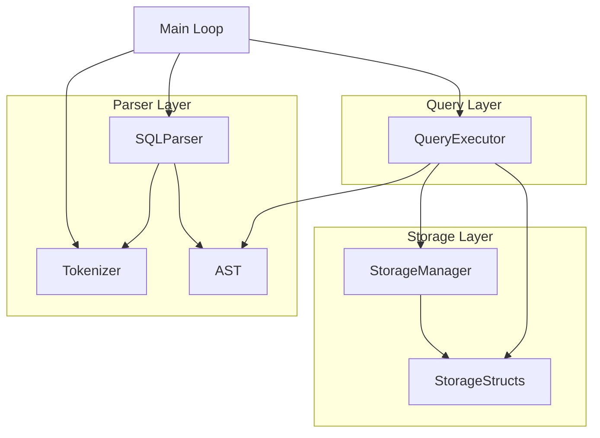

```text
Resources Links:
https://cstack.github.io/db_tutorial/parts/part1.html;
https://www.youtube.com/watch?v=5Pc18ge9ohI
https://tdop.github.io/
```

# Internal Logic Documentation

> **Note**: This document provides a mid-level technical overview of the FeatherDB implementation. It is intended for developers who need to understand the internal mechanics, state management, and side effects of modifying the codebase.

## 1. The Interaction Map

The system follows a classic **Interpreter Pattern** pipeline where text input is transformed into an intermediate representation (AST) and then executed against a storage backend. The data flow moves strictly unidirectionally from Parser to Query to Storage, with the Storage layer returning raw data back up to the Query engine for processing.

### **Pipeline Architecture**

1.  **Frontend (REPL)**: Accepts raw string input.
2.  **Parser Layer**:
    *   **Tokenizer**: Breaks raw strings into atomic units (Tokens).
    *   **SQLParser**: Consumes tokens to validate syntax and construct an **Abstract Syntax Tree (AST)**.
    *   *Interface*: The `SQLParser` hands off a `std::unique_ptr<AST>` to the `QueryExecutor`. This is a stateless hand-off; the parser parses one statement and dies.
3.  **Query Engine**:
    *   **QueryExecutor**: Traverses the AST. It holds logic for filtering, sorting, and geometric operations.
    *   *Interface*: It requests data from `StorageManager` via static method calls (e.g., `StorageManager::loadTable`). It receives a `Table` struct (in-memory representation of the full dataset).
4.  **Storage Engine**:
    *   **StorageManager**: Handles File I/O. It creates, reads, and writes files in the `db/` directory.
    *   *Data Structure*: Passes `Table`, `Row`, and `Column` structs (defined in `StorageStructs.h`) by value to/from the Query engine.

## 2. Folder-Level Technical Specs

### `src/parser`
**Core Logic**: Recursive Descent Parsing. The parser looks at the current token and decides which method to call (`parseSelect`, `parseInsert`, etc.) based on the grammar.  
**State Management**: Transient. The `SQLParser` and `Tokenizer` exist only for the duration of a single query parse.

#### `Tokenizer.h/cpp`
*   **Primary Responsibility**: Lexical Analysis. Converts `SELECT * FROM` into `[KEYWORD:SELECT, OPERATOR:*, KEYWORD:FROM]`.
*   **Modding Impact**:
    *   Adding a new keyword (e.g., `JOIN`) requires updating `isKeyword` vector.
    *   Modifying `isStringDelimiter` affects how string literals are parsed (currently hardcoded to single quotes `'`).
    *   **Critical**: Changing token definitions here breaks `SQLParser` expectations.

#### `AST.h/cpp`
*   **Primary Responsibility**: Defines the Data Structures for the syntax tree. Base class `AST` with polymorphic children `SelectStatement`, `InsertStatement`, etc.
*   **Modding Impact**:
    *   Adding a field here (e.g., `Offset` to `SelectStatement`) requires updates in `SQLParser` (to populate it) and `QueryExecutor` (to use it).

#### `SQLParser.h/cpp`
*   **Primary Responsibility**: Syntax Validation & Tree Construction. Enforces grammar rules (e.g., `SELECT` must be followed by columns).
*   **Modding Impact**:
    *   If you change the order of expect calls (e.g., expecting `FROM` before columns), you fundamentally change the SQL dialect supported by the DB.

---

### `src/query`
**Core Logic**: Iterative Execution & In-Memory Processing. The engine performs full table scans for operations. Sorting uses Quicksort.  
**State Management**: Stateless. `QueryExecutor` is instantiated per query. It builds transient `Table` objects during execution.

#### `QueryExecutor.h/cpp`
*   **Primary Responsibility**: The "Brain". Executes logic for CRUD operations.
    *   `executeSelect`: Performs filtering (`WHERE`), sorting (`ORDER BY`), and projection (column selection).
    *   `evaluateSimple`: Helper function for `WHERE` clause logic (supports =, >, <, !=).
*   **Modding Impact**:
    *   **Critical**: Logic here assumes all data fits in memory. Modifying `executeSelect` to support streaming would require rewriting the entire function and `StorageManager` interface.
    *   Sorting logic (`quickSort`) is recursive; deep recursion on large datasets could cause stack overflow.

---

### `src/storage`
**Core Logic**: Direct File I/O. Data is stored in CSV format; Schema is stored in space-separated text files.  
**State Management**: Stateless class (Static methods). No buffer pool or caching. Every read opens the file fresh.

#### `StorageStructs.h`
*   **Primary Responsibility**: POCO (Plain Old CLR Object) equivalent structs. `Table`, `Row`, `Column`.
*   **Modding Impact**:
    *   Changing `Row::values` from `std::vector<std::string>` to `std::vector<std::variant...>` would require massive refactoring in both `QueryExecutor` and `StorageManager`.

#### `StorageManager.h/cpp`
*   **Primary Responsibility**: Disk Persistence.
    *   `loadTable`: **O(n) I/O**. Reads entire file into memory.
    *   `saveTable`: **O(n) I/O**. Truncates file and dumps memory state to disk.
    *   `appendRow`: **O(1) I/O**. Appends to end of file (optimized for INSERT).
*   **Modding Impact**:
    *   Changing the file path logic (currently `db/<name>.csv`) requires migration of existing data folders.
    *   Modifying the CSV parsing logic in `loadTable` invalidates all existing database files.

---

### `src/utils`
**Core Logic**: Helper utilities.
**State Management**: Stateless.

#### `Print.h/cpp` & `Validators.h/cpp`
*   **Primary Responsibility**: Currently empty/stubs or for debugging.
*   **Modding Impact**: Minimal. Safe to modify/remove without breaking core logic (unless code is added that relies on them).

## 3. Trace a Request

**Scenario**: `SELECT * FROM users WHERE id = 1`

1.  **Entry**: `main.cpp` receives the string.
2.  **Tokenization**:
    *   `Tokenizer` identifies `SELECT` -> Keyword, `*` -> Operator, `FROM` -> Keyword, `users` -> Identifier, `WHERE` -> Keyword, `id` -> Identifier, `=` -> Operator, `1` -> Number.
3.  **Parsing**:
    *   `SQLParser::parse()` calls `parseSelect()`.
    *   Inside `parseSelect()`:
        *   Consumes `SELECT`.
        *   Parses columns `["*"]`.
        *   Consumes `FROM`, gets table `users`.
        *   Consumes `WHERE`, captures condition string `id = 1`.
    *   Returns `std::unique_ptr<SelectStatement>`.
4.  **Execution** (`QueryExecutor::execute`):
    *   Dispatches to `executeSelect`.
5.  **Data Retrieval** (`StorageManager::loadTable("users")`):
    *   Opens `db/users.schema`. Reads column definitions.
    *   Opens `db/users.csv`. Reads **every line**, splits by comma, creates `Row` objects.
    *   Returns complete populated `Table` object.
6.  **Filtering** (`QueryExecutor`):
    *   Iterates through `Table.rows`.
    *   For each row, calls `evaluateSimple(row, "id = 1")`.
        *   Finds index of "id" column.
        *   Converts string value to `int` (if column type is INT).
        *   Compares `1 == 1`.
    *   Matches are added to `filteredTable`.
7.  **Result**: `filteredTable` is printed to stdout.

**Serialization Point**:
*   **Deserialization**: Happens in `StorageManager::loadTable` (Line -> Row).
*   **Serialization**: Happens in `StorageManager::saveTable` (Row -> Line) or `appendRow`.

## 4. Component Dependencies

The system follows a strict layered architecture to minimize circular dependencies.



### Dependency Rules:
1.  **Storage Agnosticism**: The `Parser` knows **nothing** about `Storage`. It deals purely in syntax.
2.  **Query Orchestration**: The `QueryExecutor` is the only component that bridges `AST` (Intent) and `Storage` (Data).
3.  **Utils Isolation**: `Utils` are standalone helpers (though currently underutilized) and should not depend on core modules.

### Impact Analysis 

| Component | Modifying | Removing |
| :--- | :--- | :--- |
| **Parser** | Changing `lexer.go` (Tokenizer) rules breaks `parser.go` expectations of token types. | System cannot interpret any text input. |
| **Query** | Changing `evaluateSimple` affects logic for ALL clauses (WHERE, JOIN conditions if added). | System creates parse trees but does nothing with them. |
| **Storage** | Modifying `loadTable` to use binary format breaks compatibility with all existing CSV files. | System becomes ephemeral (in-memory only); data lost on exit. |

## 5. Object-Oriented Architectural Principles

This section analyzes how the FeatherDB codebase applies core Object-Oriented Programming principles and SOLID design patterns.

### Encapsulation

**Definition**: Hiding implementation details and exposing only necessary interfaces.

**Implementation in FeatherDB**:

The `StorageManager` class  demonstrates strong encapsulation by hiding all physical file I/O operations from the Query layer:

- **Public Interface**: Static methods like `loadTable()`, `saveTable()`, `appendRow()` expose high-level operations
- **Hidden Details**: File paths (`db/<tableName>.csv`, `db/<tableName>.schema`), file stream management, CSV parsing logic, and filesystem operations are completely internal to 
- **Data Transfer Objects**: The `Table`, `Row`, and `Column` structs in [StorageStructs.h](file:///d:/iut%20student%20life/labtasks/spl1/src/storage/StorageStructs.h) act as pure data containers with public members, serving as the contract between layers

**Key Observation**: The `QueryExecutor`  calls `StorageManager::loadTable()` without any knowledge of whether data comes from CSV files, binary formats, or network storage. This abstraction allows the storage backend to be swapped without touching query logic.

**Private/Protected Data**:
- in `Tokenizer` class  `input`, `position`, `currentToken`, and `currentTokenType` are private, exposing only `nextToken()` and `hasNext()` methods
- File handles and parsing logic in `StorageManager.cpp` are implementation details never exposed to callers

### Abstraction

**Definition**: Defining interfaces that hide complexity and allow for multiple implementations.

**Implementation in FeatherDB**:

1. **AST Base Class** 
   ```cpp
   class AST {
   public:
       std::string type;
       virtual ~AST() = default;
       virtual std::string toString() const = 0;  // Pure virtual
   };
   ```
   - The pure virtual `toString()` method enforces a contract: all statement types must provide string representation
   - The `QueryExecutor::execute()` method accepts `std::unique_ptr<AST>`, allowing it to work with any statement type without knowing concrete details

2. **Swappable Backends** (Theoretical):
   - While the current implementation uses static methods, the `StorageManager` interface could be converted to a virtual base class
   - This would allow `DiskStorage` and `MemoryStorage` implementations to be swapped at runtime
   - **Current Limitation**: Static methods prevent polymorphic storage backends, but the clean interface makes refactoring straightforward

### Inheritance vs. Composition

**Analysis**: FeatherDB uses **both** patterns strategically based on the use case.

#### Where Inheritance is Used:

**AST Hierarchy** 
- `SelectStatement`, `InsertStatement`, `UpdateStatement`, `DeleteStatement`, `CreateStatement` all inherit from `AST`
- **Rationale**: These classes share common behavior (type identification, string representation) and benefit from polymorphic dispatch
- **Benefit**: The parser can return `std::unique_ptr<AST>` without the caller needing to know the specific statement type upfront

#### Where Composition is Used:

**Data Structures** :
- `Table` **has-a** `std::vector<Column>` and `std::vector<Row>` (lines 20-24)
- `Row` **has-a** `std::vector<std::string>` (line 16-18)
- **Rationale**: A `Table` is not a specialized type of `Column`; it *contains* columns. Composition models the real-world relationship correctly
- **Benefit**: Avoids fragile base class problems and allows flexible data structure evolution

**Why This Choice for a Database?**
- **Inheritance for Behavior**: SQL statements have different execution logic but share common parsing/validation workflows
- **Composition for Data**: Tables, rows, and columns have "has-a" relationships, not "is-a" relationships. Using composition prevents tight coupling and makes the schema flexible

### Polymorphism

**Definition**: The ability to treat objects of different types uniformly through a common interface.

**Implementation in FeatherDB**:

1. **AST Execution** :
   ```cpp
   void QueryExecutor::execute(std::unique_ptr<AST> ast) {
       if (ast->type == "CREATE") {
           handleCreate(static_cast<CreateStatement*>(ast.get()));
       } else if (ast->type == "INSERT") {
           handleInsert(static_cast<InsertStatement*>(ast.get()));
       } else if (ast->type == "SELECT") {
           // ...
       }
   }
   ```
   - **Runtime Polymorphism**: The `execute()` method dispatches to different handlers based on the runtime type
   - **Note**: This uses manual type checking rather than virtual methods. A more advanced design would use the Visitor pattern or virtual `execute()` methods in each AST subclass

2. **Nested Query Execution** :
   - The `executeSelect()` method recursively calls itself for nested `SELECT` statements
   - This demonstrates polymorphic recursion: the same function handles both top-level and nested queries

**Polymorphic Behavior in Query Engine**:
- Different execution paths for `Scan` (full table load), `Filter` (WHERE clause evaluation), and `Sort` (ORDER BY)
- The `evaluateSimple()` function handles both integer and string comparisons polymorphically based on column type

### SOLID Compliance

#### **S - Single Responsibility Principle**

**`src/parser`**: The Parser layer has **one job**: convert raw text into an Abstract Syntax Tree.
- `Tokenizer` ): Lexical analysis only. It knows nothing about SQL grammar or disk storage.
- `SQLParser`: Syntax validation and tree construction. It does not execute queries or touch files.
- **Impact**: You can change the storage format from CSV to binary without modifying a single line in the parser.

**`src/storage`**: The Storage layer has **one job**: persist and retrieve data.
- `StorageManager` : Handles file I/O. It knows nothing about SQL syntax or query optimization.
- **Impact**: You can add a new SQL keyword (e.g., `LIMIT`) without touching storage code.

#### **O - Open/Closed Principle**

**AST Extensibility**: The system is **open for extension** but **closed for modification**.
- Adding a new statement type (e.g., `DropStatement`) requires:
  1. Creating a new class that inherits from `AST`
  2. Adding a handler in `QueryExecutor`
  3. **No modification** to the base `AST` class or existing statement types
- The `AST` base class defines a stable interface that doesn't need to change when new statements are added.

#### **L - Liskov Substitution Principle**

**AST Hierarchy**: Any `AST` subclass can be substituted for the base class without breaking the program.
- The `QueryExecutor::execute()` method accepts `std::unique_ptr<AST>` and works correctly with any derived type
- All AST subclasses implement `toString()`, maintaining the contract defined by the base class
- **Compliance**: You can pass a `SelectStatement`, `InsertStatement`, or any other AST subclass to `execute()`, and the system behaves correctly.

#### **I - Interface Segregation Principle**

**Focused Interfaces**: Clients are not forced to depend on methods they don't use.
- `StorageManager` provides specific methods (`loadTable`, `saveTable`, `appendRow`) rather than a monolithic "do everything" interface
- The `QueryExecutor` only calls the storage methods it needs for each operation (e.g., `INSERT` uses `appendRow`, not `saveTable`)
- **Benefit**: If you add a new storage operation (e.g., `updateRow`), existing code that doesn't need it remains unaffected.

#### **D - Dependency Inversion Principle**

**Abstraction Over Concreteness**: High-level modules depend on abstractions, not concrete implementations.
- `QueryExecutor` depends on the **abstract** `AST` interface, not concrete `SelectStatement` or `InsertStatement` classes
- The `execute()` method accepts `std::unique_ptr<AST>`, allowing any AST subclass to be passed
- **Limitation**: `StorageManager` uses static methods, which violates DIP. A better design would use a `IStorageManager` interface with virtual methods, allowing dependency injection of different storage backends.

### Summary: OOP Design Strengths and Weaknesses

**Strengths**:
- Clean separation of concerns (Parser, Query, Storage)
- Effective use of inheritance for polymorphic AST handling
- Composition-based data structures avoid tight coupling
- Strong encapsulation in the Storage layer

**Areas for Improvement**:
- Replace manual type checking in `execute()` with virtual methods or the Visitor pattern
- Convert `StorageManager` static methods to an interface-based design for true polymorphism
- Add access modifiers (private/protected) to AST subclass members for better encapsulation

